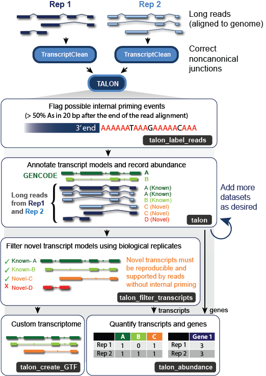
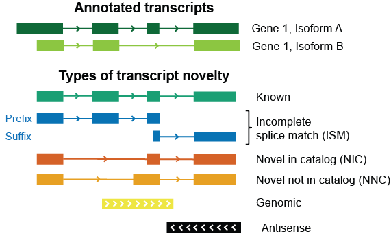

# TALON


TALON is a Python package for identifying and quantifying known and novel genes/isoforms
in long-read transcriptome data sets. TALON is technology-agnostic in that it
works from mapped SAM files, allowing data from different sequencing platforms
(i.e. PacBio and Oxford Nanopore) to be analyzed side by side.

## Table of contents
* [Installation](#installation)
* [Running TALON](#how_to_run)
  * [Flagging reads for internal priming](#label_reads)
  * [Initializing a TALON database](#db_init)
  * [Annotating reads with TALON](#run_talon)
* [Working with the TALON results](#talon_utils)
  * [Accessing abundance information](#talon_abundance)
  * [Filtering transcript models](#talon_filter)
* [Citing TALON](#talon_cite)

Reads must be aligned to the reference genome prior to using TALON. We recommend the Minimap2 aligner - please see their GitHub page [here](https://github.com/lh3/minimap2) for recommended long-read parameters by technology. Please note that TALON requires the SAM MD tag, so Minimap2 should be run with the --MD flag enabled. In principle, you can use any other long-read alignment software provided that an MD tag is generated.

We also recommend correcting the aligned reads with [TranscriptClean](https://github.com/mortazavilab/TranscriptClean) to fix artifactual noncanonical splice junctions, though this is not strictly necessary for TALON to run.

To learn more about how TALON works, please see our preprint in BioRxiv: https://www.biorxiv.org/content/10.1101/672931v1

# <a name="installation"></a>Installation
Newer versions of TALON (v4.0+) are designed to be run with Python 3.6+.

To install TALON, simply download the files using Github's "Download ZIP" button, then unzip them in the directory where you would like to store the program. Alternately, you can download a specific version of the program from the Releases tab.

Go to the directory and run:
```
pip install cython
pip install .
```
This will install TALON. You can now run the commands from anywhere.

NOTE: Talon versions 4.2 and lower are not installable. Check the README of those releases to see how you can run the scripts from the install directory, or visit the wiki [here](https://github.com/mortazavilab/TALON/wiki/Archived-TALON-documentation).


# <a name="how_to_run"></a>How to run
For a small, self-contained example with all necessary files included, see https://github.com/mortazavilab/TALON/tree/master/example

## <a name="label_reads"></a>Flagging reads for internal priming
Current long-read platforms that rely on poly-(A) selection are prone to internal priming artifacts. These occur when the oligo-dT primer binds off-target to A-rich sequences inside an RNA transcript rather than at the end. Therefore, we recommend running the **`talon_label_reads`** utility on each of your SAM files separately to record the fraction of As in the n-sized window immediately following each read alignment (reference genome sequence). The default n value is 20 bp, but you can adjust this to match the length of the T sequence in your primer if desired. The output of talon_label_reads is a SAM file with the fraction As recorded in the fA:f custom SAM tag. Non-primary alignments are omitted. This SAM file can now be used as your input to the TALON annotator.
```
Usage: talon_label_reads [options]

Options:
  -h, --help            show this help message and exit
  --f=SAM_FILE          SAM file of transcripts
  --g=GENOME_FILE       Reference genome fasta file
  --t=THREADS           Number of threads to run
  --ar=FRACA_RANGE_SIZE
                        Size of post-transcript interval to compute fraction
                        As on. Default = 20
  --tmpDir=TMP_DIR      Path to directory for tmp files. Default =
                        tmp_label_reads
  --deleteTmp           If this option is set, the temporary directory
                        generated by the program will be removed at the end of
                        the run.
  --o=OUTPREFIX         Prefix for outfiles
```

## <a name="db_init"></a>Initializing a TALON database
The first step in using TALON is to initialize a SQLite database from the GTF annotation of your choice (i.e. GENCODE). This step is done using **`talon_initialize_database`**, and only needs to be performed once for your analysis. Keep track of the build and annotation names you choose, as these will be used downstream when running TALON and its utilities.

NOTE: The GTF file you use must contain genes, transcripts, and exons. If the file does not contain explicit gene and/or transcript entries, key tables of the database will be empty and you will experience problems in the downstream analysis. Please see our [GTF troubleshooting section](https://github.com/mortazavilab/TALON/wiki/Formatting-a-GTF-annotation-to-work-with-TALON) for help.

```
Usage: talon_initialize_database [options]

Options:
  -h, --help           Show help message and exit
  --f                  GTF annotation file
  --g                  The name of the reference genome build that the annotation describes. Use a short and memorable name since you will need to specify the genome build when you run TALON later.
  --a                  The name of the annotation (for metadata purposes)
  --l                  Minimum required transcript length (default = 0 bp)
  --idprefix           Prefix for naming novel discoveries in eventual TALON runs (default = 'TALON')
  --5p                 Maximum allowable distance (bp) at the 5' end during annotation (default = 500 bp)
  --3p                 Maximum allowable distance (bp) at the 3' end during annotation (default = 300 bp)
  --o                  Output prefix for the database
```

## <a name="run_talon"></a>Running TALON
Now that you've initialized your database and checked your reads for evidence of internal priming, you're ready to annotate them. The input database is modified in place to track and quantify transcripts in the provided dataset(s). In a talon run, each input SAM read is compared to known and previously observed novel transcript models on the basis of its splice junctions. This allows us to not only assign a novel gene or transcript identity where appropriate, but to track new transcript models and characterize how they differ from known ones. The types of novelty assigned are shown in this diagram.


To run the **`talon`** annotator, create a comma-delimited configuration file with the following four columns: name, sample description, platform, sam file (full path). There should be one line for each dataset, and dataset names must be unique. If you decide later to add more datasets to an existing analysis, you can do so by creating a new config file for this data and running TALON again on the existing database.

If you're using the `--cb` option, the dataset names will be pulled from the SAM CB tag, making the first column of the config file unnecessary. Accordingly, TALON expects that when the `--cb` tag is provided, the config file only includes the following: sample description, platform, sam file (full path).

Please note that TALON versions 4.4+ can be run in multithreaded fashion for a much faster runtime.

```
usage: talon [-h] [--f CONFIG_FILE] [--db FILE,] [--build STRING,]
             [--threads THREADS] [--cov MIN_COVERAGE]
             [--identity MIN_IDENTITY] [--o OUTPREFIX]

optional arguments:
  -h, --help            show this help message and exit  
  --f CONFIG_FILE       Dataset config file: dataset name, sample description,
                        platform, sam file (comma-delimited)  
  --db FILE,            TALON database. Created using
                        talon_initialize_database
  --cb                  Use cell barcode tags to determine dataset. Useful for
                        single-cell data. Requires 3-entry config file.
  --build STRING,       Genome build (i.e. hg38) to use. Must be in the
                        database.
  --threads THREADS, -t THREADS
                        Number of threads to run program with.
  --cov MIN_COVERAGE, -c MIN_COVERAGE
                        Minimum alignment coverage in order to use a SAM
                        entry. Default = 0.9
  --identity MIN_IDENTITY, -i MIN_IDENTITY
                        Minimum alignment identity in order to use a SAM
                        entry. Default = 0.8
  --tmpDir 
                        Path to directory for tmp files. Default = `talon_tmp/`
  --o OUTPREFIX         Prefix for output files

```
TALON generates two output files in the course of a run. The QC log (file with suffix **`'QC.log'`**) is useful for tracking why a particular read was or was not included in the TALON analysis.
<details>
<summary>QC log format</summary>  

Columns:  
1. dataset  	
2. read_ID  	
3. passed_QC (1/0)  	
4. primary_mapped (1/0)  
5. read_length
6. fraction_aligned
7. Identity

</details>

The second output file (suffix **`'read_annot.tsv'`**) appears at the very end of the run and contains a line for every read that was successfully annotated.
<details>
<summary>Read annotation file format</summary>

Columns:  
1. Name of individual read  
2. Name of dataset the read belongs to  
3. Name of genome build used in TALON run  
4. Chromosome  
5. Read start position (1-based). This refers to the 5' end start, so for reads on the - strand, this number will be larger than the read end (col 6).  
6. Read end position (1-based). This refers to the 3' end stop, so for reads on the - strand, this will be smaller than the read start (col 5).  
7. Strand (+ or -)  
8. Number of exons in the transcript  
9. Read length (soft-clipped bases not included)  
10. Gene ID (issued by TALON, integer)  
11. Transcript ID (issued by TALON, integer)  
12. Annotation gene ID
13. Annotation transcript ID
14. Annotation gene name (human-readable gene symbol)  
15. Annotation transcript name (human-readable transcript symbol)  
16. Gene novelty: one of "Known", "Antisense", or "Intergenic".   
17. Transcript novelty: one of "Known", "ISM", "NIC", "NNC", "Antisense", "Intergenic", or "Genomic".   
18. ISM subtype. If transcript novelty is not ISM, this field will be 'None'. If the transcript is an ISM, then this field can be 'Prefix', 'Suffix', 'Both', or 'None'.    
19. fraction_As: From the talon_label_reads step. Records the fraction of As present in the n bases after the read alignment.  
20. Custom_label: If the user provided a custom SAM flag (lC:Z), the value will be shown here.    
21. Allelic_label: If the user provided a custom SAM flag (lA:Z) to denote which allele a read came from, the value will be shown here.    	
22. Start_support: If the user provided a custom SAM flag (tS:Z) to denote external evidence for the start site of a read, the value will be shown here.   
23. End_support: If the user provided a custom SAM flag (tE:Z to denote external evidence for the end site of a read, the value will be shown here.  

</details>

It is also possible to obtain this file from a TALON database at any time by running the **`talon_fetch_reads`** utility.
```
Usage: talon_fetch_reads [-h] [--db FILE,] [--build STRING,]
                         [--datasets STRING,] [--o OUTPREFIX]

optional arguments:
  -h, --help          show this help message and exit
  --db FILE,          TALON database
  --build STRING,     Genome build (i.e. hg38) to use. Must be in the
                      database.
  --datasets STRING,  Optional: Comma-delimited list of datasets to include.
                      Default behavior is to include all datasets in the
                      database.
  --o OUTPREFIX       Prefix for output files
```

# <a name="talon_utils"></a>Working with the TALON results

## <a name="talon_abundance"></a>Accessing abundance information

The **`talon_abundance`** module can be used to extract a raw or filtered transcript count matrix from your TALON database. Each row of this file represents a transcript detected by TALON in one or more of your datasets. To generate a file suitable for gene expression analysis, skip the --whitelist option (i.e. make an unfiltered abundance file). To generate a file for isoform-level analysis, please see the next section to generate a whitelist file to use.
```
Usage: talon_abundance [options]

Options:
  -h, --help            show this help message and exit
  --db=FILE             TALON database
  -a ANNOT, --annot=ANNOT
                        Which annotation version to use. Will determine which
                        annotation transcripts are considered known or novel
                        relative to. Note: must be in the TALON database.
  --whitelist=FILE      Whitelist file of transcripts to include in the
                        output. First column should be TALON gene ID,
                        second column should be TALON transcript ID
  -b BUILD, --build=BUILD
                        Genome build to use. Note: must be in the TALON
                        database.
  -d FILE, --datasets=FILE
                        Optional: A file indicating which datasets should be
                        included (one dataset name per line). Default is to
                        include                   all datasets.
  --o=FILE              Prefix for output file
```

Please note to run this utility, you must provide genome build (-b) and annotation (-a) names that match those provided for the talon_initialize_database, otherwise it will not run.

<details>
<summary>Abundance file format</summary>

The columns in the abundance file are as follows:
1. TALON gene ID
2. TALON transcript ID
3. Gene ID from your annotation of choice. If the gene is novel relative to that annotation, this will be the TALON-derived name.
4. Transcript ID from your annotation of choice. If the transcript is novel relative to that annotation, this will be the TALON-derived name.
5. Gene name from your annotation of choice (makes the file a bit more human-readable!). If the transcript is novel relative to that annotation, this will be the TALON-derived name.
6. Transcript name from your annotation of choice. If the transcript is novel relative to that annotation, this will be the TALON-derived name.
7. Number of exons in the transcript
8. Length of transcript model (nucleotides). Note: For known transcripts, this will be the length of the model as defined in the annotation. The actual reads that matched it may not be that length. For actual read lengths, see the read_annot output file.
9. Gene novelty (Known, Antisense, Intergenic)
10. Transcript status (Known, ISM, NIC, NNC, Antisense, Intergenic)
11. ISM subtype (Both, Prefix, Suffix, None)  
**---------------------------- Remaining columns -----------------------------**  
One column per dataset, with a count indicating how many times the current transcript was observed in that dataset.

</details>

## <a name="talon_filter"></a>Filtering your transcriptome for isoform-level analysis

Before quantifying your results on the isoform level, it is important to filter the novel transcript models because long-read platforms are prone to several forms of artifacts. The most effective experimental design for filtering is to use biological replicates. Some limited filtering is possible even for singlet datasets, but keep in mind that this is likely to be far less effective.

The **`talon_filter_transcripts`** module generates a whitelist of transcripts that are either:  
a) Known  
b) Observed at least n times in each of k datasets.  
The default value for n is 5 and the default for k is the total number of datasets you provide for filtering. In addition, the filter requires that all n reads used to support a novel transcript must not have evidence of internal priming (default: internal priming defined as > 0.5 fraction As). If you wish to disregard internal priming, set --maxFracA to 1 (not generally recommended).
```
Usage: talon_filter_transcripts [options]

Options:
  -h, --help            show this help message and exit
  --db=FILE             TALON database
  -a ANNOT, --annot=ANNOT
                        Which annotation version to use. Will determine which
                        annotation transcripts are considered known or novel
                        relative to. Note: must be in the TALON database.
  --datasets=DATASETS   Datasets to include. Can be provided as a comma-
                        delimited list on the command line, or as a file with
                        one dataset per line. If this option is omitted, all
                        datasets will be included.
  --maxFracA=MAX_FRAC_A
                        Maximum fraction of As to allow in the window located
                        immediately after any read assigned to a novel
                        transcript (helps to filter out internal priming
                        artifacts). Default = 0.5. Use 1 if you prefer to not
                        filter out internal priming.
  --minCount=MIN_COUNT  Number of minimum occurrences required for a novel
                        transcript PER dataset. Default = 5
  --minDatasets=MIN_DATASETS
                        Minimum number of datasets novel transcripts must be
                        found in. Default = all datasets provided
  --allowGenomic        If this option is set, transcripts from the Genomic
                        novelty category will be permitted in the output
                        (provided they pass the thresholds). Default behavior
                        is to filter out genomic transcripts since they are
                        unlikely to be real novel isoforms.
  --o=FILE              Outfile name

```
The columns in the resulting output file are:
1. TALON gene ID (an integer). This is the same type of ID found in column 1 of TALON abundance files.
2. TALON transcript ID (an integer). This is the same type of ID found in column 2 of TALON abundance files.

## Obtaining a custom GTF transcriptome annotation from a TALON database

You can use the **`talon_create_GTF`** utility to extract a GTF-formatted annotation from the TALON database.
```
Usage: talon_create_GTF [options]

Options:
  -h, --help            show this help message and exit
  --db=FILE             TALON database
  -b BUILD, --build=BUILD
                        Genome build to use. Note: must be in the TALON
                        database.
  -a ANNOT, --annot=ANNOT
                        Which annotation version to use. Will determine which
                        annotation transcripts are considered known or novel
                        relative to. Note: must be in the TALON database.
  --whitelist=FILE      Whitelist file of transcripts to include in the
                        output. First column should be TALON gene ID,
                        second column should be TALON transcript ID
  --observed            If this option is set, the GTF file will only
                        include transcripts that were observed in at least one
                        dataset (redundant if dataset file provided).
  -d FILE, --datasets=FILE
                        Optional: A file indicating which datasets should be
                        included (one dataset name per line). Default is to
                        include                   all datasets.
  --o=FILE              Prefix for output GTF
```

Please note to run this utility, you must provide genome build (-b) and annotation (-a) names that match those provided for the talon_initialize_database, otherwise it will not run.

# <a name="talon_cite"></a>Citing TALON
Please cite our preprint when using TALON:  

*A technology-agnostic long-read analysis pipeline for transcriptome discovery and quantification.*
Dana Wyman, Gabriela Balderrama-Gutierrez, Fairlie Reese, Shan Jiang, Sorena Rahmanian, Weihua Zeng, Brian Williams, Diane Trout, Whitney England, Sophie Chu, Robert C. Spitale, Andrea J. Tenner, Barbara J. Wold, Ali Mortazavi
bioRxiv 672931; doi: https://doi.org/10.1101/672931

# License
MIT, see LICENSE
