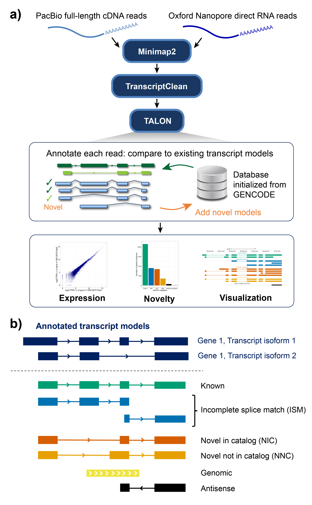

TALON is a Python program for identifying known and novel genes/isoforms
in long read transcriptome data sets. TALON is technology-agnostic in that it
works from mapped SAM files, allowing data from different sequencing platforms
(i.e. PacBio and Oxford Nanopore) to be analyzed side by side. 

To learn more, please see our preprint in BioRxiv: https://www.biorxiv.org/content/10.1101/672931v1

# Installation
Newer version of TALON (v4.0+) are designed to be run with Python 3.7 (tested specifically with Python 3.7.2). Older versions of TALON use Python 2.7.

To install TALON, simply download the files using Github's "Download ZIP" button, then unzip them in the directory where you would like to store the program. Alternately, you can download a specific version of the program from the Releases tab. The TALON scripts are run directly from the command line- just include the path.

# How to run

## Initializing a TALON database
The first step in using TALON is to initialize a SQLite database from the GTF annotation of your choice (i.e. GENCODE). This step is done using initialize_talon_database.py, and only needs to be performed once. Keep track of the build and annotation names you choose, as these will be used downstream when running TALON and its utilities.

```
python initialize_talon_database.py --h

Usage: initialize_talon_database.py [options]

Options:
  -h, --help           Show help message and exit
  --f                  GTF annotation file
  --g                  The name of the reference genome build that the annotation describes. Use a short and memorable name since you will need to specify the genome build when you run TALON later.
  --a                  The name of the annotation (for metadata purposes)
  --l                  Minimum required transcript length (default = 300 bp)
  --idprefix           Prefix for naming novel discoveries in eventual TALON runs (default = 'TALON')
  --5p                 Maximum allowable distance (bp) at the 5' end during annotation (default = 500 bp)
  --3p                 Maximum allowable distance (bp) at the 3' end during annotation (default = 300 bp)
  --o                  Output prefix for the database
```

## Running TALON
Now that you've initilialized your database, you're ready to annotate long read datasets using TALON. The input database is modified in place to track and quantify transcripts in the provided dataset(s). You can add more datasets at any time by creating a config file for them and running this command. 

```
python talon.py --h

Usage: talon.py [options]

Options:
-h, --help            Show help message and exit
--f                   Comma-delimited dataset config file providing sam files for TALON to run on, as well as metadata that   will be tracked in the dataset table. The required format is: dataset name, sample description, platform, sam file (full path).
  --db FILE,            TALON database. Created using build_talon_annotation.py
  --build STRING,       Genome build (i.e. hg38) to use. Must be in the
                        database.
  --cov, -c             Minimum alignment coverage in order to use a SAM entry. Default = 0.9
  --identity, -i        Minimum alignment identity in order to use a SAM entry. Default = 0
  --o OUTPREFIX         Prefix for output files
```

## TALON utilities

### Obtaining an abundance matrix from your TALON database
If you would like to extract an abundance matrix for your TALON-processed datasets, use the script *create_abundance_file_from_database.py* from the post-TALON_tools directory.

```
python post-TALON_tools/create_abundance_file_from_database.py --h

Usage: create_abundance_file_from_database.py [options]

Options:
  -h, --help            show this help message and exit
  --db=FILE             TALON database
  -a ANNOT, --annot=ANNOT
                        Which annotation version to use. Will determine which
                        annotation transcripts are considered known or novel
                        relative to. Note: must be in the TALON database.
  -b BUILD, --build=BUILD
                        Genome build to use. Note: must be in the TALON
                        database.
  --filter              If this option is set, the transcripts in the
                        database will be filtered prior to GTF creation
                        (for more information, see
                        filter_talon_transcripts.py)
  -p FILE, --pairings=FILE
                        Optional (only relevant if filter = true): A file
                        indicating which datasets should be
                        considered together when filtering
                        novel transcripts (i.e. biological replicates).
                        Format: Each line of the file constitutes a group,
                        with member datasets separated by
                        commas. If no file is provided, then
                        novel transcripts appearing in any
                        two datasets will be accepted.
  --o=FILE              Prefix for output file
```
The columns in the abundance file are as follows:
1. TALON gene ID
2. TALON transcript ID	
3. Gene ID from your annotation of choice. If the gene is novel relative to that annotation, this will be 'NA'.
4. Transcript ID from your annotation of choice. If the transcript is novel relative to that annotation, this will be 'NA'.
5. Gene name from your annotation of choice (makes the file a bit more human-readable!). If the transcript is novel relative to that annotation, this will be the TALON-derived name.
6. Transcript name from your annotation of choice. If the transcript is novel relative to that annotation, this will be the TALON-derived name.	
7. Number of exons in the transcript
8. Length of transcript model (basepairs)
9. Gene novelty (Known, Antisense, Intergenic)	
10. Transcript status (Known, ISM, NIC, NNC, Antisense, Intergenic)
11. ISM subtype (Both, Prefix, Suffix, None)  
**---------------------------- Remaining columns -----------------------------**  
One column per dataset, with a count indicating how many times the current transcript was observed in that dataset. 

# License
MIT, see LICENSE
